# Roomly MVP System Design

Roomly is an India-first roommate matching platform. The MVP focuses on helping students, interns, freshers, and working professionals find compatible roommates before they decide which flat or PG to rent together.

The product is not a room-listing marketplace in the MVP. Rooms/flats may be discussed after a match, but the primary object is the person: their budget, city, move-in date, lifestyle, food preference, habits, safety signals, and roommate expectations.

---

## 1. MVP Goals

### Primary Goal

Connect two or more compatible people who want to rent a place together.

### Core User Jobs

- I am moving to a city for college, internship, job, coaching, or study.
- I need a roommate with similar budget, location preference, move-in date, and lifestyle.
- I want to avoid unsafe, fake, or incompatible people.
- I want to chat only after mutual interest.
- I want enough information to decide whether this person is worth discussing flats with.

### MVP Scope

Included:

- Phone/email based signup and login
- Optional Google login
- User profile
- Roommate preference profile
- Verification signals
- Compatibility score
- Swipe based discovery
- Mutual match creation
- Chat between matched users
- Report and block
- Basic admin review for reports

Not included in MVP:

- Flat or room listing marketplace
- Rent payment
- Broker integration
- Legal rental agreement signing
- Advanced machine learning recommendations
- Native mobile apps
- Video calling

---

## 2. High-Level Architecture

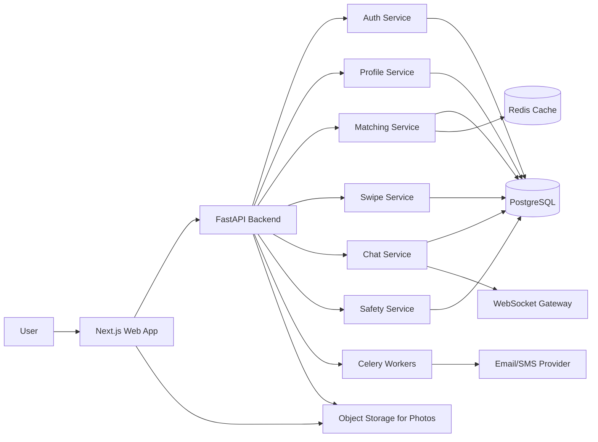

### Recommended MVP Stack

| Layer | Choice | Reason |
|---|---|---|
| Frontend | Next.js | Fast web MVP, mobile responsive |
| Backend | FastAPI | Simple async APIs and WebSockets |
| Database | PostgreSQL | Reliable relational data and filters |
| Cache | Redis | Match cache, sessions, rate limits |
| Background jobs | Celery | Emails, notifications, moderation jobs |
| Storage | S3 compatible storage | Profile photos |
| Hosting | Vercel + Render/Railway/Fly.io | Simple MVP deployment |

---

## 3. Product Modules

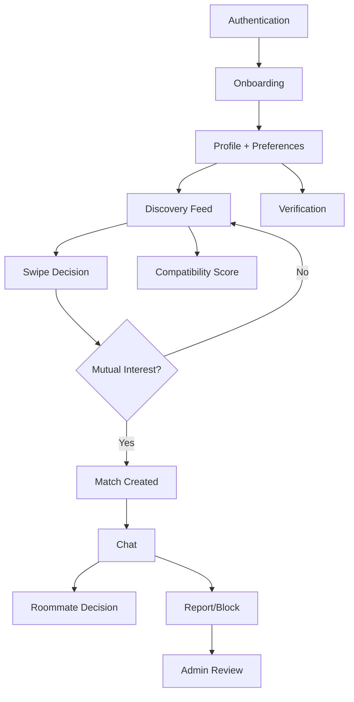

### Module Responsibilities

| Module | Responsibility |
|---|---|
| Auth | Signup, login, JWT/session, password reset |
| Profile | Name, age range, gender, city, education/job, bio, photos |
| Preferences | Budget, move-in date, areas, food, habits, cleanliness, guests |
| Verification | Phone, email, college/company email, ID optional |
| Matching | Candidate generation and compatibility scoring |
| Swipe | Interested/skip/super-like decisions |
| Match | Mutual interest, match state, match history |
| Chat | Messaging only between matched users |
| Safety | Block, report, moderation, rate limits |
| Admin | Review reports, ban users, remove photos/content |

---

## 4. Main User Flow

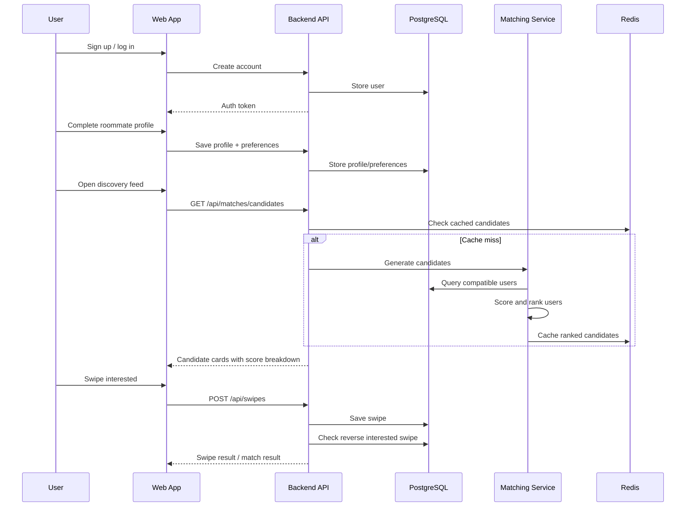

---

## 5. Swipe and Match Flow

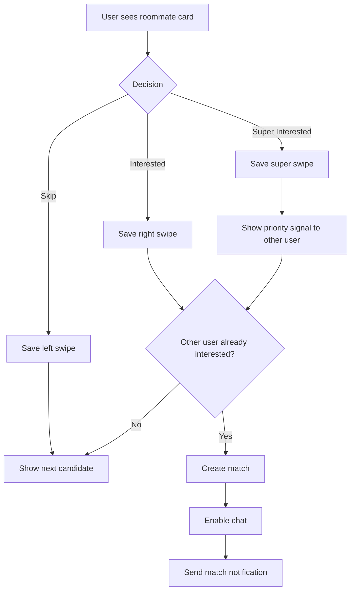

### Swipe Rules

- A user cannot swipe on the same candidate twice.
- Blocked users never appear in discovery.
- Reported users may be downranked or hidden depending on severity.
- Users should not see candidates without enough profile completeness.
- Users should not see candidates outside city, move-in window, or budget hard filters unless they allow flexible matching.

---

## 6. Data Model

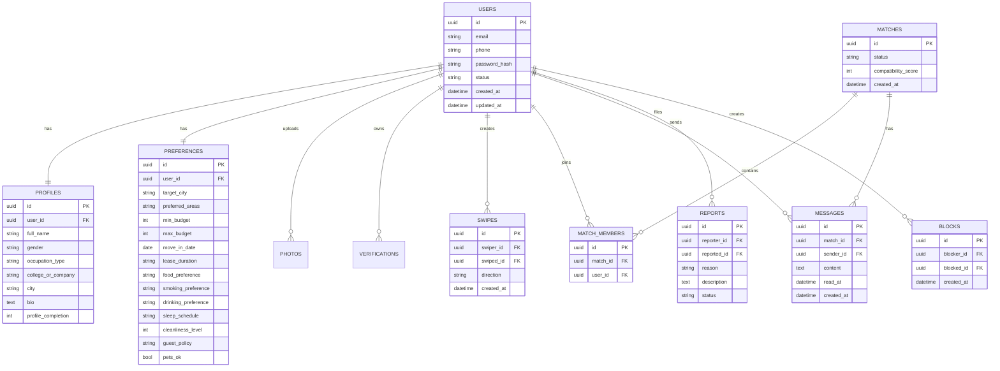

### Important Modeling Choice

Use a `matches` table plus a `match_members` table instead of only `user1_id` and `user2_id`. This keeps the MVP ready for future group matching, such as 3 people trying to rent a 3BHK together.

For the first MVP, allow only 1-to-1 matches. The schema can still support groups later.

---

## 7. Candidate Generation

Candidate generation decides who can appear in the discovery feed.

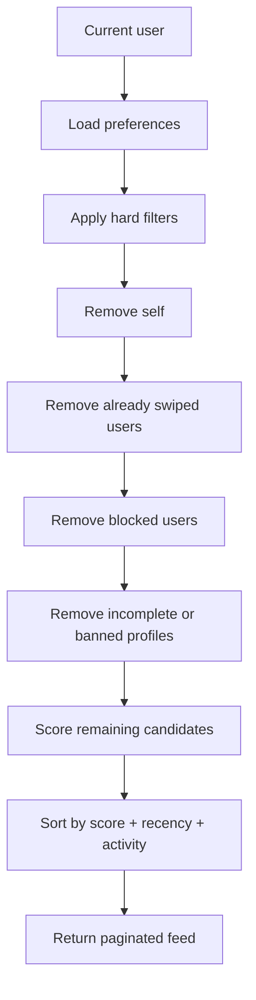

### Hard Filters

Use hard filters first to avoid showing obviously bad candidates:

- Same target city
- Move-in date within acceptable range
- Budget overlap exists
- Profile is active
- Profile has minimum required fields
- User is not blocked, banned, or already swiped

### Soft Filters

Soft filters affect score but do not always remove the candidate:

- Preferred areas
- Food preference
- Sleep schedule
- Cleanliness
- Smoking/drinking comfort
- Guest policy
- Pets
- Occupation type
- Language preference

---

## 8. Compatibility Scoring

The score should be simple and explainable in the MVP.

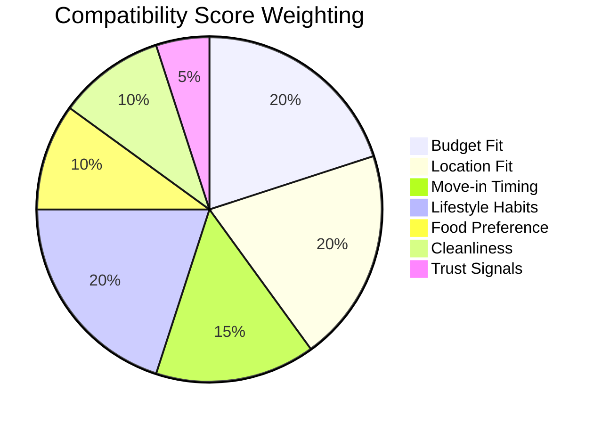

### MVP Score Formula

| Factor | Weight | Example |
|---|---:|---|
| Budget fit | 20 | Their budget ranges overlap |
| Location fit | 20 | Same city and common preferred areas |
| Move-in timing | 15 | Move-in dates are close |
| Lifestyle habits | 20 | Smoking, drinking, guests, parties, sleep |
| Food preference | 10 | Veg/non-veg cooking comfort |
| Cleanliness | 10 | Similar cleanliness level |
| Trust signals | 5 | Phone, email, college/company verified |

### Score Output

Do not show only `84% match`. Show the explanation:

- Budget: strong match
- Move-in: both looking for August
- Food: both vegetarian
- Cleanliness: similar
- Smoking: potential mismatch

This builds trust and helps users decide.

---

## 9. API Surface

### Auth

| Method | Endpoint | Purpose |
|---|---|---|
| POST | `/api/auth/register` | Create account |
| POST | `/api/auth/login` | Login |
| POST | `/api/auth/refresh` | Refresh token |
| POST | `/api/auth/google` | Google login |
| GET | `/api/auth/me` | Current user |

### Profile and Preferences

| Method | Endpoint | Purpose |
|---|---|---|
| GET | `/api/profile/me` | Get my profile |
| PUT | `/api/profile/me` | Update profile |
| GET | `/api/preferences/me` | Get roommate preferences |
| PUT | `/api/preferences/me` | Update roommate preferences |
| POST | `/api/photos` | Upload profile photo |
| DELETE | `/api/photos/{photo_id}` | Remove photo |

### Discovery, Swipes, Matches

| Method | Endpoint | Purpose |
|---|---|---|
| GET | `/api/discovery/candidates` | Get ranked roommate candidates |
| POST | `/api/swipes` | Save skip/interested/super decision |
| GET | `/api/matches` | List my matches |
| GET | `/api/matches/{match_id}` | Match details |

### Chat

| Method | Endpoint | Purpose |
|---|---|---|
| WS | `/ws/matches/{match_id}` | Real-time chat |
| GET | `/api/matches/{match_id}/messages` | Message history |
| POST | `/api/matches/{match_id}/messages` | REST fallback for message send |

### Safety

| Method | Endpoint | Purpose |
|---|---|---|
| POST | `/api/reports` | Report user |
| POST | `/api/blocks` | Block user |
| GET | `/api/blocks/me` | My blocked users |
| DELETE | `/api/blocks/{block_id}` | Unblock user |

---

## 10. Chat Design

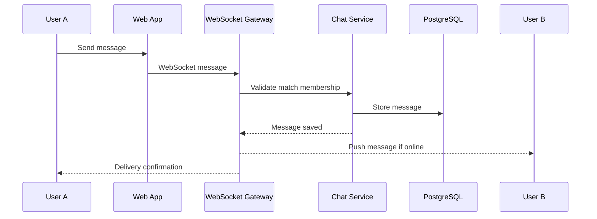

### Chat Rules

- Chat is only enabled after mutual match.
- Users can block/report directly from chat.
- Phone numbers and social handles should be hidden by default.
- Add rate limits to prevent spam.
- Add basic unsafe content detection later if needed.

---

## 11. Verification and Trust

Trust is the most important product differentiator.

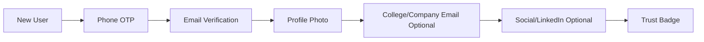

### MVP Verification Levels

| Level | Requirement | Badge |
|---|---|---|
| Level 1 | Phone verified | Phone verified |
| Level 2 | Email verified | Email verified |
| Level 3 | College/company email or LinkedIn | Work/study verified |
| Level 4 | Optional ID check | ID verified |

Do not force government ID verification at the start. It creates friction. Offer it as an optional trust upgrade.

---

## 12. Safety and Moderation

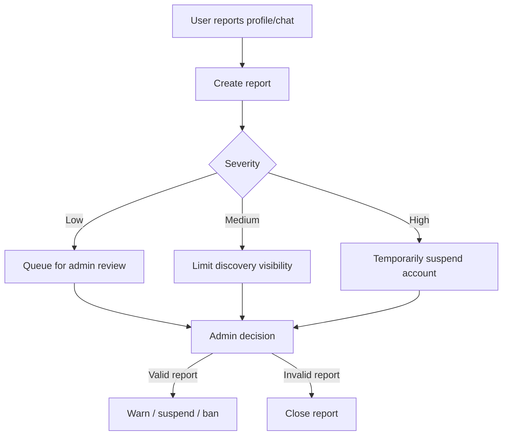

### Safety Requirements

- Blocked users cannot see each other.
- Reported users can be hidden while under review for serious issues.
- Add admin tools from the beginning, even if basic.
- Log important actions: login, swipe, match, report, block.
- Add rate limits on signup, swipes, messages, and reports.

### Women Safety Features

For India, safety should be a first-class product requirement:

- Verified-only discovery mode
- Option to show profile only to verified users
- Hidden phone number by default
- Easy report/block from every profile and chat
- Ability to pause discovery
- Optional women-only discovery preference where legally and practically appropriate

---

## 13. MVP Database Indexes

Add indexes around discovery and safety queries.

| Table | Index | Why |
|---|---|---|
| `users` | `email`, `phone` unique | Login and dedupe |
| `profiles` | `city`, `occupation_type` | Discovery filters |
| `preferences` | `target_city`, `move_in_date` | Candidate generation |
| `preferences` | `min_budget`, `max_budget` | Budget overlap |
| `swipes` | `(swiper_id, swiped_id)` unique | Prevent duplicate swipes |
| `swipes` | `swiped_id, direction` | Check mutual interest |
| `matches` | `status, created_at` | Match list |
| `match_members` | `user_id` | Find user's matches |
| `messages` | `match_id, created_at` | Chat history |
| `blocks` | `(blocker_id, blocked_id)` unique | Safety filtering |
| `reports` | `reported_id, status` | Moderation |

---

## 14. Non-Functional Requirements

### MVP Targets

| Requirement | Target |
|---|---|
| Candidate feed latency | Under 700 ms for cached results |
| Login/signup latency | Under 1 second |
| Chat delivery | Near real-time when online |
| Uptime | 99% for MVP |
| Data retention | Keep active account data; allow deletion request |
| Mobile UX | Must work well on low/mid Android browsers |

### Expected MVP Scale

Design comfortably for:

- 10,000 to 100,000 registered users
- 1,000 to 10,000 daily active users
- 100 to 1,000 concurrent users
- 10 to 100 messages per second during peak city/campus season

PostgreSQL plus Redis is enough for this scale.

---

## 15. Deployment Architecture

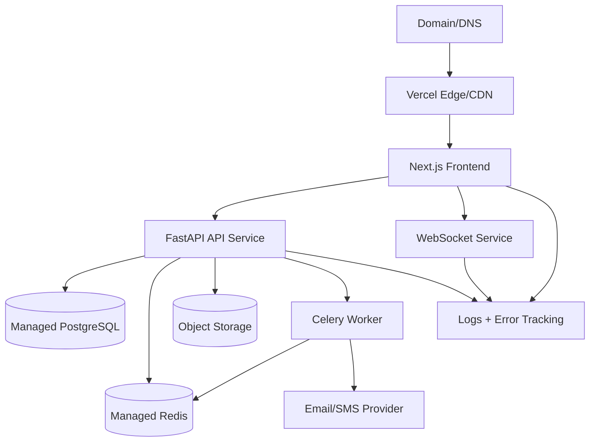

### MVP Hosting Option

- Frontend: Vercel
- Backend API: Render, Railway, Fly.io, or AWS Lightsail
- PostgreSQL: Neon, Supabase, Railway, or RDS
- Redis: Upstash or Railway
- Storage: Cloudflare R2, S3, or Supabase Storage
- Error tracking: Sentry

---

## 16. Privacy and Sensitive Data

Roomly will handle personal and lifestyle information. Keep the MVP privacy-conscious.

### Principles

- Collect only what is needed for roommate matching.
- Hide phone/email from other users by default.
- Do not expose exact address because the MVP is not a room listing app.
- Do not add caste or religion filters.
- Make gender-related controls safety-oriented and carefully worded.
- Allow users to delete or pause their profile.
- Keep audit logs for moderation actions.

### Sensitive Fields

Treat these carefully:

- Phone number
- Email
- Government ID if added later
- Gender
- Photos
- Chat messages
- College/company identity
- Social profile links

---

## 17. Analytics Events

Track the funnel from signup to successful roommate conversation.

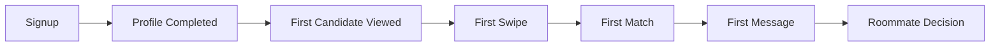

### Key Metrics

| Metric | Why It Matters |
|---|---|
| Profile completion rate | Shows onboarding quality |
| Candidate view to swipe rate | Shows feed relevance |
| Right swipe rate | Shows supply quality |
| Match rate | Shows compatibility and density |
| Match to first message rate | Shows trust and intent |
| Report rate | Shows safety/quality issues |
| Repeat search rate | Shows retention |
| Successful roommate decision | Main product outcome |

---

## 18. Phased Roadmap

### Phase 1: MVP

- Signup/login
- Profile and preferences
- Candidate feed
- Swipe decisions
- Mutual matches
- Chat
- Report/block
- Basic verification

### Phase 2: Trust and Conversion

- College/company verification
- Compatibility explanation
- Roommate agreement checklist
- Guided chat prompts
- Better admin moderation
- Notifications

### Phase 3: Group Matching

- 3-person and 4-person roommate groups
- Group chat
- Group budget and area preferences
- "Looking for one more roommate" mode

### Phase 4: Housing Coordination

This is not room listing, but coordination after match:

- Shared shortlist links
- Flat visit planning
- Rent/deposit split notes
- Move-in checklist
- Broker/contact notes controlled by users

---

## 19. Main Risks and Mitigations

| Risk | Why It Matters | Mitigation |
|---|---|---|
| Low local density | Users see too few candidates | Launch city by city, campus by campus |
| Fake profiles | Destroys trust | Phone verification, report/block, admin review |
| Safety concerns | Especially important in India | Verified mode, privacy controls, hidden contact info |
| Dating-app perception | Can reduce trust | Use roommate-focused language and UI |
| Too many filters | Can reduce matches | Use hard filters only for essentials |
| Seasonal demand | Users search around move-in cycles | Target college admission and job joining seasons |
| Marketplace cold start | Need both sides | Start with dense communities and referrals |

---

## 20. Design Decisions for the MVP

### Keep

- Roommate-first model
- Swipe based discovery
- Compatibility score with explanations
- Mutual match before chat
- Trust and safety features from day one
- Mobile-first web app

### Avoid Initially

- Full property listings
- Complex ML
- Payments
- Too many profile questions
- Public phone numbers
- Nationwide launch on day one

### Recommended Launch Strategy

Start with one dense segment:

- One city: Pune, Bengaluru, Delhi NCR, Hyderabad, Mumbai, or Kota
- One group: students, interns, or freshers
- One season: admission/joining/move-in window

The MVP should prove that users can go from signup to a real roommate conversation quickly.
